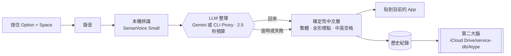

# Atype

按住熱鍵說話，放開就得到可以直接送出的**繁體中文**：去掉贅詞、保留中英夾雜、全形標點、中英之間有空格，不出簡體，不改你的意思。

這是自用的 Typeless。Mac 已經能用；iPhone 是下一步，做成和 Typeless 一樣的鍵盤。架構圖解在 [`docs/architecture.html`](docs/architecture.html)。


## 在 Mac 上安裝

只支援 Apple 晶片（M1 以後）的 Mac。LLM 整理可用 Gemini API key，或透過 CLIProxyAPI 使用已登入的供應商。

- **下載編好的 App**：到 [Releases](https://github.com/JohnKeng/Atype/releases/latest) 下載 zip，把 `Atype.app` 拖進「應用程式」。App 沒有經過 Apple 公證，第一次打開會被擋，要到「系統設定 → 隱私權與安全性」按「仍要打開」。
- **自己編**：需要 Xcode Command Line Tools、Rust、bun、cmake，第一次約 5 到 10 分鐘。

```bash
git clone https://github.com/JohnKeng/Atype.git
cd Atype/apps/mac
bun install
bun run app:install      # 編譯並安裝到「應用程式」
```

兩種方式的詳細步驟、被擋時怎麼打開、第一次設定（下載模型、設定 LLM、給權限）與每天的用法，都在 [`apps/mac/README.md`](apps/mac/README.md)。

## 怎麼運作



- **聲音不離開這台 Mac**。只有辨識出來的文字會送到 LLM 整理，而且可以關掉。
- **繁體與排版由程式保證**，不靠 LLM 記得。LLM 慢或失敗時，貼的是本機處理過的原文。
- **每一筆輸入都存一份**到 `atype.jsonl` 和每日 Markdown，給之後的搜尋與摘要用。

## 目錄

| 路徑 | 內容 |
|---|---|
| [`apps/mac/`](apps/mac/README.md) | Mac App。Atype 自己的程式在 `src-tauri/src/atype/` |
| [`site/`](site/index.html) | 產品介紹頁（GitHub Pages） |
| [`docs/demo-script.md`](docs/demo-script.md) | 錄影與測試腳本 |
| [`docs/PLAN.md`](docs/PLAN.md) | 決策、下一步、iPhone 鍵盤計畫、模型、prompt、測試句 |
| [`docs/architecture.html`](docs/architecture.html) | 圖解架構：Mac 與 iPhone 鍵盤的流程、和 Typeless 的功能對照 |
| [`docs/archive/`](docs/archive/README.md) | 早期研究與商用版方案，不再維護 |

## 致謝

Mac 版的桌面殼（熱鍵、錄音、貼上、浮窗、模型執行）來自 CJ Pais 的 [Handy](https://github.com/cjpais/Handy)，MIT 授權，授權條款保留在 `apps/mac/LICENSE`。
